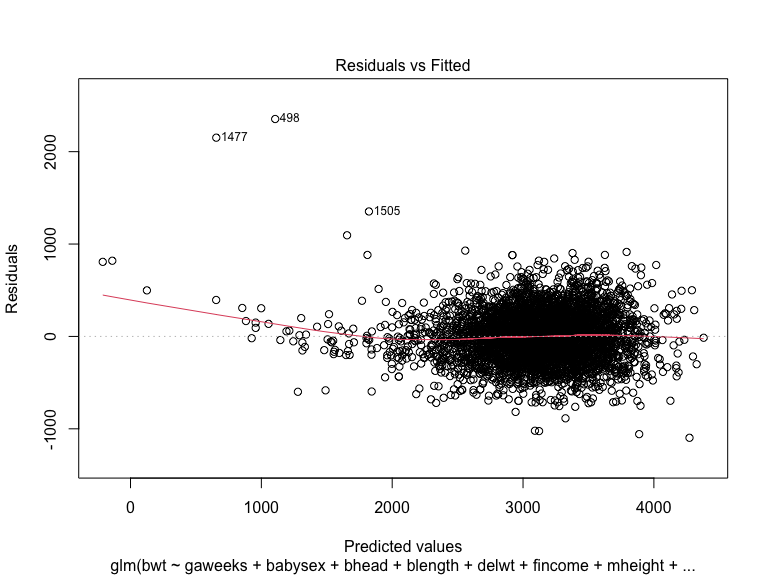
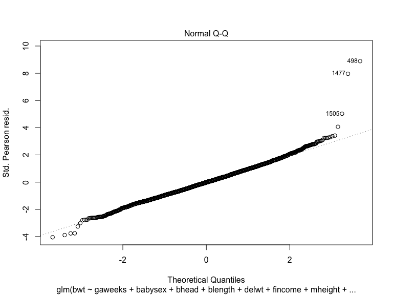
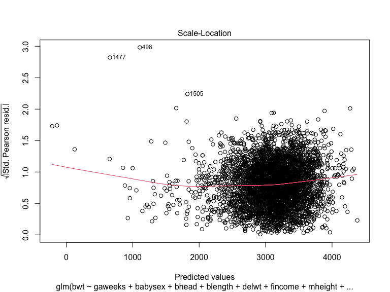
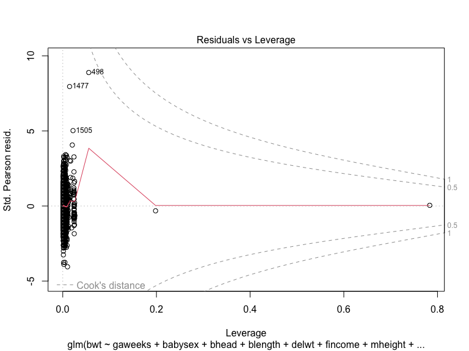
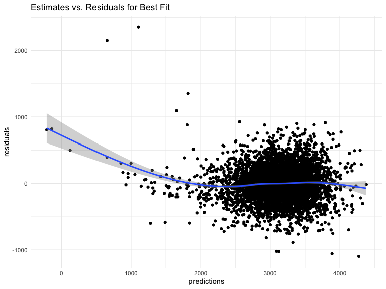
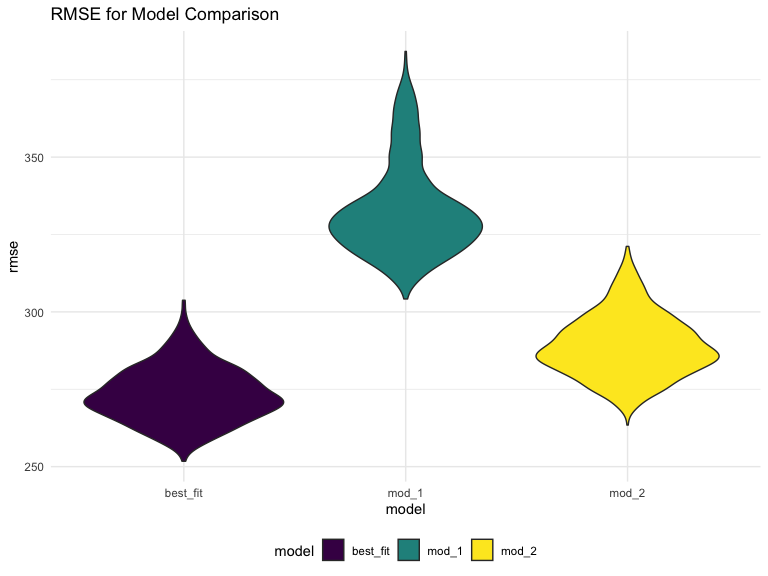

p8105_hw6_brm2150
================
Brooklynn McNeil
2024-11-19

## Problem 1

## Problem 2

Load the homicide data. Create a binary variable for the status for
solved/not solved. Filter out cities that don’t report race, and only
include Black and White races

``` r
url = "https://raw.githubusercontent.com/washingtonpost/data-homicides/master/homicide-data.csv"
homicide_dat = 
  read_csv(url, na = "Unknown") |>
  mutate(city_state = str_c(city, ", ", state),
         status = case_when(
           disposition %in% c("Closed without arrest", "Closed by arrest") ~ 0,
           disposition == "Open/No arrest" ~ 1
           )) |>
  filter(!city_state %in% c("Dallas, TX", "Phoenix, AZ", "Kansas City, MO", "Tulsa, AL"),
         victim_race %in% c("White", "Black"))
```

    Warning: One or more parsing issues, call `problems()` on your data frame for details,
    e.g.:
      dat <- vroom(...)
      problems(dat)

    Rows: 52179 Columns: 12
    ── Column specification ────────────────────────────────────────────────────────
    Delimiter: ","
    chr (8): uid, victim_last, victim_first, victim_race, victim_sex, city, stat...
    dbl (4): reported_date, victim_age, lat, lon

    ℹ Use `spec()` to retrieve the full column specification for this data.
    ℹ Specify the column types or set `show_col_types = FALSE` to quiet this message.

``` r
head(homicide_dat)
```

    # A tibble: 6 × 14
      uid   reported_date victim_last victim_first victim_race victim_age victim_sex
      <chr>         <dbl> <chr>       <chr>        <chr>            <dbl> <chr>     
    1 Alb-…      20100601 SATTERFIELD VIVIANA      White               15 Female    
    2 Alb-…      20100102 MULA        VIVIAN       White               72 Female    
    3 Alb-…      20100126 BOOK        GERALDINE    White               91 Female    
    4 Alb-…      20100130 MARTIN-LEY… GUSTAVO      White               56 Male      
    5 Alb-…      20100218 LUJAN       KEVIN        White               NA Male      
    6 Alb-…      20100308 GRAY        STEFANIA     White               43 Female    
    # ℹ 7 more variables: city <chr>, state <chr>, lat <dbl>, lon <dbl>,
    #   disposition <chr>, city_state <chr>, status <dbl>

Create a logistic regression for `status` as the outcome and `age`,
`race`, and `sex` as predictors for Baltimore, MD.

``` r
baltimore_glm = 
  homicide_dat |>
  filter(city_state == "Baltimore, MD") |>
  glm(status ~ victim_age + victim_race + victim_sex, data = _, family = "binomial")

tidy_results = broom::tidy(baltimore_glm, conf.int = TRUE, exponentiate = TRUE)

# show odds ratio for men
tidy_results |>
  filter(term == "victim_sexMale") |>
  select(-c(std.error, statistic, p.value))
```

    # A tibble: 1 × 4
      term           estimate conf.low conf.high
      <chr>             <dbl>    <dbl>     <dbl>
    1 victim_sexMale     2.82     2.14      3.74

Now let’s map this across all of the cities, and then plot the odds
ratios for murders of men being solved compared to compare across
cities.

``` r
citywide_odds = 
  homicide_dat |>
  group_by(city_state) |>
  nest() |>
  mutate(
    glm = map(data, \(df) glm(status ~ victim_age + victim_race + victim_sex, data = df, family = "binomial")),
    glm = map(glm, \(i) broom::tidy(i, conf.int = TRUE, exponentiate = TRUE)),
  ) |>
  unnest(glm) |>
  filter(term == "victim_sexMale")

citywide_odds |>
  mutate(city_state = factor(city_state, levels = citywide_odds$city_state[order(citywide_odds$estimate)])) |>
  ggplot(aes(x = city_state, y = estimate)) +
  geom_point() +
  geom_errorbar(aes(ymin = conf.low, ymax = conf.high)) +
  geom_hline(yintercept = 1, linetype = "dashed", color = "red") +
  theme(
    axis.text.x = element_text(angle = 45, hjust = 1)) +
  labs(title = "Odds Ratios for Homicides Status by Sex",
       x = ("City, State"),
       y = "odds ratio")
```


It looks like most cities have a higher ratio of homicides of men
getting solved than to women. The city where the highest ratio is in New
York. Long Beach, CA has a very wide confidence interval, but even so
the interquantile range does not include an odds ratio that men’s
homcides are not solved more often.

## Problem 3

Read in the birth weight data.

``` r
birthweight_df = 
  read_csv("data/birthweight.csv") |>
  mutate(across(c("babysex", "frace", "malform", "mrace"), factor))
```

    Rows: 4342 Columns: 20
    ── Column specification ────────────────────────────────────────────────────────
    Delimiter: ","
    dbl (20): babysex, bhead, blength, bwt, delwt, fincome, frace, gaweeks, malf...

    ℹ Use `spec()` to retrieve the full column specification for this data.
    ℹ Specify the column types or set `show_col_types = FALSE` to quiet this message.

``` r
any(is.na(birthweight_df))
```

    [1] FALSE

Let’s take a quick look at the data. It’s normally distributed.

``` r
birthweight_df |>
  ggplot(aes(x = bwt)) +
  geom_histogram()
```

    `stat_bin()` using `bins = 30`. Pick better value with `binwidth`.


Let’s fit a generalized model with all predictors using `glm` and then
narrow it down with `step_AIC`. Make sure variance inflation factor is
\<5 to check for colinearity of predictors.

``` r
fit = 
  birthweight_df |>
  glm(bwt ~ gaweeks + babysex + bhead + blength + delwt + fincome + frace + malform + menarche + mheight + momage + mrace + parity + pnumlbw + pnumsga + ppbmi + ppwt + smoken + wtgain, data = _ )

summary(fit)
```


    Call:
    glm(formula = bwt ~ gaweeks + babysex + bhead + blength + delwt + 
        fincome + frace + malform + menarche + mheight + momage + 
        mrace + parity + pnumlbw + pnumsga + ppbmi + ppwt + smoken + 
        wtgain, data = birthweight_df)

    Deviance Residuals: 
         Min        1Q    Median        3Q       Max  
    -1097.68   -184.86     -3.33    173.09   2344.15  

    Coefficients: (3 not defined because of singularities)
                  Estimate Std. Error t value Pr(>|t|)    
    (Intercept) -6265.3914   660.4011  -9.487  < 2e-16 ***
    gaweeks        11.5494     1.4654   7.882 4.06e-15 ***
    babysex2       28.7073     8.4652   3.391 0.000702 ***
    bhead         130.7781     3.4523  37.881  < 2e-16 ***
    blength        74.9536     2.0217  37.075  < 2e-16 ***
    delwt           4.1007     0.3948  10.386  < 2e-16 ***
    fincome         0.2898     0.1795   1.614 0.106551    
    frace2         14.3313    46.1501   0.311 0.756168    
    frace3         21.2361    69.2960   0.306 0.759273    
    frace4        -46.9962    44.6782  -1.052 0.292912    
    frace8          4.2969    74.0741   0.058 0.953745    
    malform1        9.7650    70.6259   0.138 0.890039    
    menarche       -3.5508     2.8951  -1.226 0.220083    
    mheight         9.7874    10.3116   0.949 0.342588    
    momage          0.7593     1.2221   0.621 0.534418    
    mrace2       -151.4354    46.0453  -3.289 0.001014 ** 
    mrace3        -91.3866    71.9190  -1.271 0.203908    
    mrace4        -56.4787    45.1369  -1.251 0.210901    
    parity         95.5411    40.4793   2.360 0.018307 *  
    pnumlbw             NA         NA      NA       NA    
    pnumsga             NA         NA      NA       NA    
    ppbmi           4.3538    14.8913   0.292 0.770017    
    ppwt           -3.4716     2.6121  -1.329 0.183913    
    smoken         -4.8544     0.5871  -8.269  < 2e-16 ***
    wtgain              NA         NA      NA       NA    
    ---
    Signif. codes:  0 '***' 0.001 '**' 0.01 '*' 0.05 '.' 0.1 ' ' 1

    (Dispersion parameter for gaussian family taken to be 74241.74)

        Null deviance: 1138652193  on 4341  degrees of freedom
    Residual deviance:  320724338  on 4320  degrees of freedom
    AIC: 61042

    Number of Fisher Scoring iterations: 2

``` r
# remove unnecessary predictors
best_fit = MASS::stepAIC(fit, trace = FALSE)

summary(best_fit)
```


    Call:
    glm(formula = bwt ~ gaweeks + babysex + bhead + blength + delwt + 
        fincome + mheight + mrace + parity + ppwt + smoken, data = birthweight_df)

    Deviance Residuals: 
         Min        1Q    Median        3Q       Max  
    -1097.18   -185.52     -3.39    174.14   2353.44  

    Coefficients:
                  Estimate Std. Error t value Pr(>|t|)    
    (Intercept) -6098.8219   137.5463 -44.340  < 2e-16 ***
    gaweeks        11.5925     1.4621   7.929 2.79e-15 ***
    babysex2       28.5580     8.4549   3.378 0.000737 ***
    bhead         130.7770     3.4466  37.944  < 2e-16 ***
    blength        74.9471     2.0190  37.120  < 2e-16 ***
    delwt           4.1067     0.3921  10.475  < 2e-16 ***
    fincome         0.3180     0.1747   1.820 0.068844 .  
    mheight         6.5940     1.7849   3.694 0.000223 ***
    mrace2       -138.7925     9.9071 -14.009  < 2e-16 ***
    mrace3        -74.8868    42.3146  -1.770 0.076837 .  
    mrace4       -100.6781    19.3247  -5.210 1.98e-07 ***
    parity         96.3047    40.3362   2.388 0.017004 *  
    ppwt           -2.6756     0.4274  -6.261 4.20e-10 ***
    smoken         -4.8434     0.5856  -8.271  < 2e-16 ***
    ---
    Signif. codes:  0 '***' 0.001 '**' 0.01 '*' 0.05 '.' 0.1 ' ' 1

    (Dispersion parameter for gaussian family taken to be 74165.07)

        Null deviance: 1138652193  on 4341  degrees of freedom
    Residual deviance:  320986412  on 4328  degrees of freedom
    AIC: 61029

    Number of Fisher Scoring iterations: 2

``` r
plot(best_fit)
```



``` r
# check for multicollinearity
car::vif(best_fit)
```

                GVIF Df GVIF^(1/(2*Df))
    gaweeks 1.245075  1        1.115829
    babysex 1.045505  1        1.022499
    bhead   1.826019  1        1.351303
    blength 1.769732  1        1.330313
    delwt   4.437162  1        2.106457
    fincome 1.205999  1        1.098180
    mheight 1.315871  1        1.147114
    mrace   1.439897  3        1.062646
    parity  1.008629  1        1.004305
    ppwt    4.345209  1        2.084516
    smoken  1.101300  1        1.049428

Plot the modeled residuals against fitted values.

``` r
birthweight_df |>
  add_predictions(best_fit) |>
  add_residuals(best_fit) |>
  ggplot(aes(x = pred, y = resid)) +
  geom_point() +
  geom_smooth() +
  labs(title = "Estimates vs. Residuals for Best Fit",
       x = "predictions",
       y = "residuals")
```

    `geom_smooth()` using method = 'gam' and formula = 'y ~ s(x, bs = "cs")'



Compare the `best_fit` model with two other models. One using length at
birth and gestational age as predictors (main effects only) and one
using head circumference, length, sex, and all interactions (including
the three-way interaction) between these.

``` r
mod_1 = birthweight_df |>
  glm(bwt ~ gaweeks + blength, data = _ )

mod_2 = birthweight_df |>
  glm(bwt ~ babysex + bhead + blength + babysex * bhead * blength, data = _ )
```

Compare the model performance by creating 1000 test and train data sets,
then calculating rmse for each set. It looks like the `best_fit` model
outperforms the others.

``` r
set.seed(123)
results = 
  tibble(
    crossv_mc(birthweight_df, n = 1000),
    best_fit = map(train, \(df) glm(bwt ~ gaweeks + babysex + bhead + blength + delwt + 
    fincome + mheight + mrace + parity + ppwt + smoken, data = df)),
    mod_1 = map(train, \(df) glm(bwt ~ gaweeks + blength, data = df )),
    mod_2 = map(train, \(df) glm(bwt ~ babysex + bhead + blength + babysex * bhead * blength, data = df )),
    best_fit_rmse = map2_dbl(best_fit, test, \(x, y) rmse(x, y)),
    mod_1_rmse = map2_dbl(mod_1, test, \(x, y) rmse(x, y)),
    mod_2_rmse = map2_dbl(mod_2, test, \(x, y) rmse(x, y))
  )
```

    Warning in predict.lm(object, newdata, se.fit, scale = 1, type = if (type == :
    prediction from a rank-deficient fit may be misleading
    Warning in predict.lm(object, newdata, se.fit, scale = 1, type = if (type == :
    prediction from a rank-deficient fit may be misleading
    Warning in predict.lm(object, newdata, se.fit, scale = 1, type = if (type == :
    prediction from a rank-deficient fit may be misleading
    Warning in predict.lm(object, newdata, se.fit, scale = 1, type = if (type == :
    prediction from a rank-deficient fit may be misleading
    Warning in predict.lm(object, newdata, se.fit, scale = 1, type = if (type == :
    prediction from a rank-deficient fit may be misleading
    Warning in predict.lm(object, newdata, se.fit, scale = 1, type = if (type == :
    prediction from a rank-deficient fit may be misleading
    Warning in predict.lm(object, newdata, se.fit, scale = 1, type = if (type == :
    prediction from a rank-deficient fit may be misleading
    Warning in predict.lm(object, newdata, se.fit, scale = 1, type = if (type == :
    prediction from a rank-deficient fit may be misleading
    Warning in predict.lm(object, newdata, se.fit, scale = 1, type = if (type == :
    prediction from a rank-deficient fit may be misleading
    Warning in predict.lm(object, newdata, se.fit, scale = 1, type = if (type == :
    prediction from a rank-deficient fit may be misleading

``` r
results |>
  pivot_longer(cols = best_fit_rmse:mod_2_rmse,
               names_to = "model",
               values_to = "rmse") |>
  mutate(model = gsub("_rmse", "", model)) |>
  ggplot(aes(x = model, y = rmse, fill = model)) +
  geom_violin() +
  labs(title = "RMSE for Model Comparison")
```


