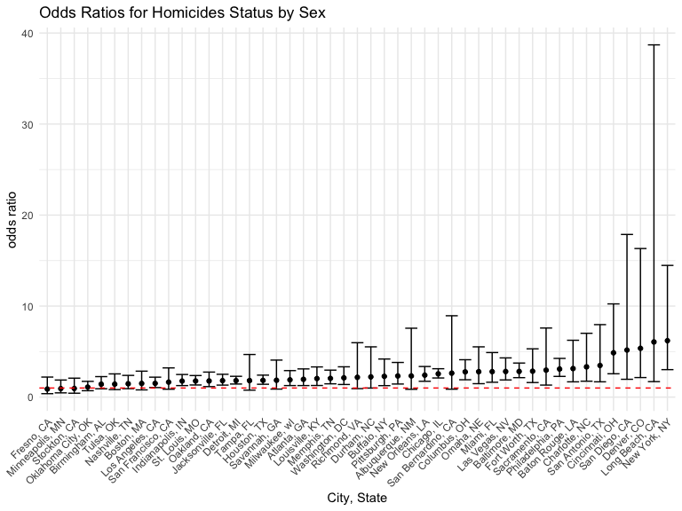
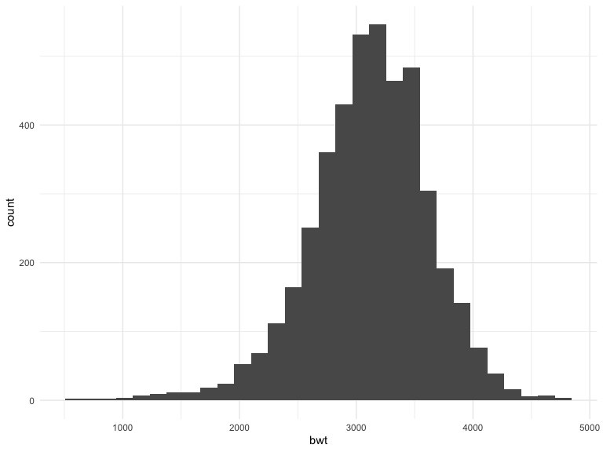
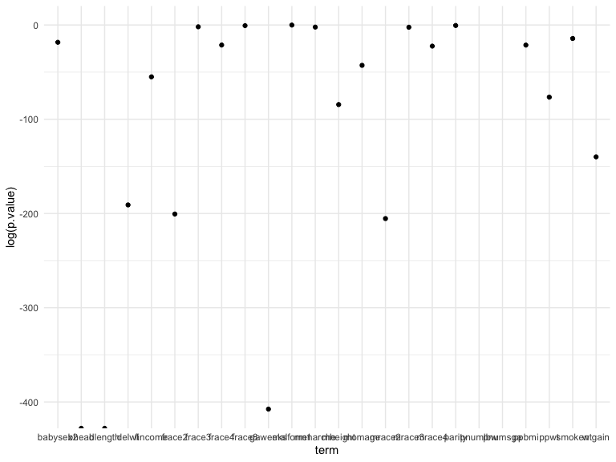

p8105_hw6_brm2150
================
Brooklynn McNeil
2024-11-19

## Problem 1

## Problem 2

Load the homicide data. Create a binary variable for the status for
solved/not solved. Filter out cities that don’t report race, and only
include Black and White races

``` r
url = "https://raw.githubusercontent.com/washingtonpost/data-homicides/master/homicide-data.csv"
homicide_dat = 
  read_csv(url, na = "Unknown") |>
  mutate(city_state = str_c(city, ", ", state),
         status = case_when(
           disposition %in% c("Closed without arrest", "Closed by arrest") ~ 0,
           disposition == "Open/No arrest" ~ 1
           )) |>
  filter(!city_state %in% c("Dallas, TX", "Phoenix, AZ", "Kansas City, MO", "Tulsa, AL"),
         victim_race %in% c("White", "Black"))
```

    Warning: One or more parsing issues, call `problems()` on your data frame for details,
    e.g.:
      dat <- vroom(...)
      problems(dat)

    Rows: 52179 Columns: 12
    ── Column specification ────────────────────────────────────────────────────────
    Delimiter: ","
    chr (8): uid, victim_last, victim_first, victim_race, victim_sex, city, stat...
    dbl (4): reported_date, victim_age, lat, lon

    ℹ Use `spec()` to retrieve the full column specification for this data.
    ℹ Specify the column types or set `show_col_types = FALSE` to quiet this message.

``` r
head(homicide_dat)
```

    # A tibble: 6 × 14
      uid   reported_date victim_last victim_first victim_race victim_age victim_sex
      <chr>         <dbl> <chr>       <chr>        <chr>            <dbl> <chr>     
    1 Alb-…      20100601 SATTERFIELD VIVIANA      White               15 Female    
    2 Alb-…      20100102 MULA        VIVIAN       White               72 Female    
    3 Alb-…      20100126 BOOK        GERALDINE    White               91 Female    
    4 Alb-…      20100130 MARTIN-LEY… GUSTAVO      White               56 Male      
    5 Alb-…      20100218 LUJAN       KEVIN        White               NA Male      
    6 Alb-…      20100308 GRAY        STEFANIA     White               43 Female    
    # ℹ 7 more variables: city <chr>, state <chr>, lat <dbl>, lon <dbl>,
    #   disposition <chr>, city_state <chr>, status <dbl>

Create a logistic regression for `status` as the outcome and `age`,
`race`, and `sex` as predictors for Baltimore, MD.

``` r
baltimore_glm = 
  homicide_dat |>
  filter(city_state == "Baltimore, MD") |>
  glm(status ~ victim_age + victim_race + victim_sex, data = _, family = "binomial")

tidy_results = broom::tidy(baltimore_glm, conf.int = TRUE, exponentiate = TRUE)

# show odds ratio for men
tidy_results |>
  filter(term == "victim_sexMale") |>
  select(-c(std.error, statistic, p.value))
```

    # A tibble: 1 × 4
      term           estimate conf.low conf.high
      <chr>             <dbl>    <dbl>     <dbl>
    1 victim_sexMale     2.82     2.14      3.74

Now let’s map this across all of the cities, and then plot the odds
ratios for murders of men being solved compared to compare across
cities.

``` r
citywide_odds = 
  homicide_dat |>
  group_by(city_state) |>
  nest() |>
  mutate(
    glm = map(data, \(df) glm(status ~ victim_age + victim_race + victim_sex, data = df, family = "binomial")),
    glm = map(glm, \(i) broom::tidy(i, conf.int = TRUE, exponentiate = TRUE)),
  ) |>
  unnest(glm) |>
  filter(term == "victim_sexMale")

citywide_odds |>
  mutate(city_state = factor(city_state, levels = citywide_odds$city_state[order(citywide_odds$estimate)])) |>
  ggplot(aes(x = city_state, y = estimate)) +
  geom_point() +
  geom_errorbar(aes(ymin = conf.low, ymax = conf.high)) +
  geom_hline(yintercept = 1, linetype = "dashed", color = "red") +
  theme(
    axis.text.x = element_text(angle = 45, hjust = 1)) +
  labs(title = "Odds Ratios for Homicides Status by Sex",
       x = ("City, State"),
       y = "odds ratio")
```


It looks like most cities have a higher ratio of homicides of men
getting solved than to women. The city where the highest ratio is in New
York. Long Beach, CA has a very wide confidence interval, but even so
the interquantile range does not include an odds ratio that men’s
homcides are not solved more often.

## Problem 3

Read in the birth weight data.

``` r
birthweight_df = 
  read_csv("data/birthweight.csv") |>
  mutate(across(c("babysex", "frace", "malform", "mrace"), factor))
```

    Rows: 4342 Columns: 20
    ── Column specification ────────────────────────────────────────────────────────
    Delimiter: ","
    dbl (20): babysex, bhead, blength, bwt, delwt, fincome, frace, gaweeks, malf...

    ℹ Use `spec()` to retrieve the full column specification for this data.
    ℹ Specify the column types or set `show_col_types = FALSE` to quiet this message.

``` r
any(is.na(birthweight_df))
```

    [1] FALSE

Let’s take a quick look at the data. It’s normally distributed.

``` r
birthweight_df |>
  ggplot(aes(x = bwt)) +
  geom_histogram()
```

    `stat_bin()` using `bins = 30`. Pick better value with `binwidth`.



Let’s make some linear models for each of the variables.

``` r
birthweight_df |>
  lm(bwt ~ fincome, data = _) |>
  broom::tidy()
```

    # A tibble: 2 × 5
      term        estimate std.error statistic  p.value
      <chr>          <dbl>     <dbl>     <dbl>    <dbl>
    1 (Intercept)  2980.      15.1       197.  0       
    2 fincome         3.05     0.296      10.3 1.26e-24

Now repeat for all predictors.

``` r
predictors = 
  birthweight_df |> 
  select(-bwt) |>
  colnames() 

single_mod_results = 
  map(predictors, ~ {
  formula = as.formula(paste("bwt ~", .x))
  lm(formula, data = birthweight_df) |>
    broom::tidy() |>
    mutate(predictor = .x)  # Add column to identify predictor
}) |>
  bind_rows()|>
  filter(term != "(Intercept)")
```

Let’s look at how all of the predictors did.

``` r
single_mod_results |>
  ggplot(aes(x = term, y = log(p.value))) +
  geom_point()
```

    Warning: Removed 2 rows containing missing values or values outside the scale range
    (`geom_point()`).


